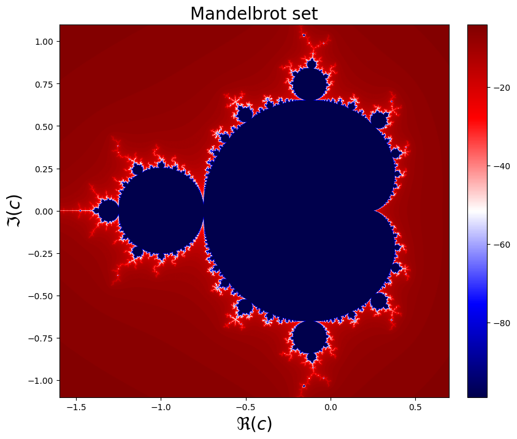

# High_perfomance_python_lab

Homeworks for the High-performance python lab course.
This course was devoted to learning how to use Python for High-Performance Computing on different architectures – multi-core CPUs and general-purpose GPUs.
The course took place Nov-Jan in 2020 (1st year).

## [Julia and Maldebrot set](https://github.com/Albly/High_perfomance_python_lab/blob/main/Fractals/Mandelbrot.ipynb)
The Mandelbrot set is the set that consists of all of those complex values C for which the corresponding orbit of 0 under z^2+C does not escape to infinity. If we plot such a set, we can see how the math can be beautiful.
Here you can find implementation of Julia and Mandelbrot sets using NumPy and also jitted version. The performance of both methods was provided. 

Julia set                                                  |  Mandelbrot set
:---------------------------------------------------------:|:-------------------------:
  |  
 
Also you can find here a code for animation of Julia set for different values of the complex parameter.

  

  
## [Biffurcation diagram](https://github.com/Albly/High_perfomance_python_lab/blob/main/Fractals/Bifurcartion_diagram.ipynb)
Is there some simple equation that can describe the population of animals, generate random numbers, and describe salamander ERG when the contrast is varying and flash frequency is constant? It is! It's the logistic map. This simple equation has chaotic behavior. You can make sure that it's true by looking at its bifurcation diagram

Here you can find Biffurcation diagram implementation with using numpy, cupy, numba and MPI with different number of precessors, and comparison of the prefomance of these methods (Spoiler: in my implementation numba is the fastest)

## [Schelling model](https://github.com/Albly/High_perfomance_python_lab/blob/main/Schelling%20model.ipynb)
Consider we have a field with shape NxN pixels and two different kinds of agents, that can occupy empty pixels of the field. Also let's come up with rule that describes behaviour of these agents: They are move to random empty point of the field if there is no R number of agents with the same type. And we can see how the image evolves during the iterations.
Here you can find jitted version of Schelling model for different R values.

## [Spectrogram](https://github.com/Albly/High_perfomance_python_lab/blob/main/Spectrogram.ipynb)
Can the signal be drawn? Yes, and the simplest way to do it - transform the signal into the frequency domain.
Here you can find an implementation of Spectrogram, that shows us a mixture of several signals (These color spots are signals)

Moreover you can find here implementation of Spectrogram using MPI. So each part of image was drawn by individual process and the result was concatenated.

## [Shifted picture](https://github.com/Albly/High_perfomance_python_lab/blob/main/Shifted_pictures/Columnwise_shifted_pictures.ipynb)
Assume we want to make a gif image where we simply roll our image. It might be slowly if we do this in a simple way. But we can split the image to parts, use MPI to have each part shifted by its individual process and concatenate the result. This will be much faster! 

(Do you like the picture? I drew it)

## Other interesting labs:

### [Integral](https://github.com/Albly/High_perfomance_python_lab/blob/main/Integral.ipynb)
Here we calculated an integral analytically and numerically using MPI.

### [SAXPY](https://github.com/Albly/High_perfomance_python_lab/blob/main/SAXPY.ipynb)
Here we compared the perfomance of NumPy and CuPy for matrix multiplication.

### [N-Body problem](https://github.com/Albly/High_perfomance_python_lab/blob/main/N-Body.ipynb)
It's example how to use Jit with OOP. Here we calculate one of the most famous physical problem - N-body problem using Numba.
